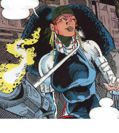

<h1 align="center">
  <br>
  recoil<br>
  <p align="center">
    <a href="https://www.codacy.com/gh/upsect/recoil/dashboard?utm_source=github.com&amp;utm_medium=referral&amp;utm_content=upsect/recoil&amp;utm_campaign=Badge_Grade"></a>
    <a href="https://www.codacy.com/gh/upsect/recoil/dashboard?utm_source=github.com&amp;utm_medium=referral&amp;utm_content=upsect/recoil&amp;utm_campaign=Badge_Coverage"></a>
  </p>
</h1>

Recoil is a React hook for just-in-time component rendering, with first-class support for [Tailwind CSS](https://tailwindcss.com/docs). Easily bind visibility and other events to viewport dimensions and breakpoints with pinpoint accuracy.

## Installation

```
% yarn install @upsect/recoil
```

## Usage

### Viewport dimensions

Recoil provides realtime viewport information that can be used to control the visibility of components or any feature that relies on the width/height of the viewport. Just call `useViewport`, and recoil will continuously update the `currentWidth` and `currentHeight` properties using the global `window.innerWidth` and `window.innerHeight` values, respectively.

```js
import * as Recoil from '@upsect/recoil'

export default function Component () {
  const viewport = Recoil.useViewport()
  return (
    <>
      {
        viewport.currentWidth > 1280 ?
          (<p>ComponentA</p>) :
          (<p>ComponentB</p>)
      }
    </>
  )
}
```

### Tailwind breakpoints

Recoil accepts breakpoint definitions using the [Tailwind breakpoint schema](https://tailwindcss.com/docs/breakpoints). Simply drop your breakpoints into `useViewport`, and recoil will continuously update the `activeBreakpoint` property with the key of the active breakpoint. Supports Tailwind's standard, max-width, and multi-range breakpoints.

```js
import * as Recoil from '@upsect/recoil'
import { screens } from 'tailwindcss/defaultTheme'

export default function Component () {
  const viewport = Recoil.useViewport(screens)
  return (
    <>
      {
        viewport.activeBreakpoint === 'lg' ?
          (<p>ComponentA</p>) :
          (<p>ComponentB</p>)
      }
    </>
  )
}
```
