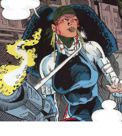

<h1 align="center">
  <br>
  recoil<br>
  <p align="center">
    <a href="https://twitter.com/nallenscott">
      
    </a>
  </p>
</h1>

Recoil is a React hook for just-in-time component rendering, with first-class support for [Tailwind CSS](https://tailwindcss.com/docs). Easily bind visibility and other events to viewport dimensions and breakpoints with pinpoint accuracy.

## Workspace

This project uses Yarn [Workspaces](https://classic.yarnpkg.com/en/docs/workspaces/).

```shell
📂 example # nextjs sandbox
📂 hook    # recoil package
```

## Developing

Run the following command from the root of the project directory to begin working on patches and new features. This will start an example site, built with [Next.js](https://nextjs.org), where you can quickly confirm your changes.

```
% yarn develop
```
